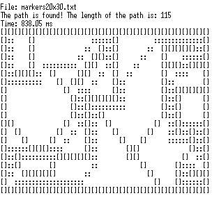

# Astar-Test readme
------

Данный мини-проект является дополнением к статье: [Алгоритм А\* для
новичков](https://vitalissius.github.io/A-Star-Pathfinding-for-Beginners/).

Результаты нахождения пути для разных случаев.

-   Классический случай, используемый при изучении A\*:

-   Классический случай обхода вогнутого препядствия:

-   Искусственный пример препятствий:

-   Лабиринт с множеством решений, без тупиков
    ([источник](https://en.wikipedia.org/wiki/Maze_solving_algorithm#/media/File:MAZE_40x20_DFS_no_deadends.png)):

-   Искусственный пример, с множеством вогнутых препятствий:

-   Искусственный пример без решения поиска кратчайшего пути (начало пути и
    фишиш находятся по разные стороны преграды):

